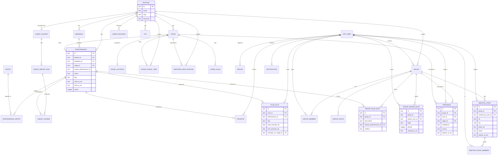

# FestPilot — V1 Data Model (Cloudflare D1 schema)

> Last updated: 2026-06-23 (from `/diagrams`). The concrete D1 (SQLite) schema for V1, derived from
> `product-spec.md`, `technical-direction.md` §4, and the approved decisions (incl. DEC-023 all-MUST,
> DEC-013 group board). Companion: `v1-use-cases.md`. The brain overrides this doc if they ever disagree.

## Conventions (D1 = SQLite)
- **Types:** `TEXT`, `INTEGER`, `REAL`. Booleans = `INTEGER` (0/1). Money = n/a.
- **Instants:** `TEXT` ISO-8601 **UTC** (e.g. `2026-07-17T19:00:00Z`); festival-local strings kept raw where the source provides them. Festival timezone stored on `festival`.
- **IDs:** our entities use `TEXT` ULIDs (`id`). Source-owned rows also keep `source_*_id` for provenance/idempotent upserts.
- **FKs:** `*_id`; every FK has an index. **Privacy:** raw `lat/lng` for *presence* are server-only (never returned to clients) — see §Privacy.
- **Naming:** snake_case tables/columns (SQL); the TS layer maps to camelCase.

---

## ER diagram

> Diagram shows relationships + key columns; the full column spec is below.

---

## Lineup domain (server-owned, read-mostly)

### `festival`
| Column | Type | Notes |
|--------|------|-------|
| id | TEXT PK | ULID |
| name | TEXT | "Tomorrowland Belgium 2026" |
| slug | TEXT | unique |
| timezone | TEXT | IANA, e.g. `Europe/Brussels` |
| created_at_utc | TEXT | |

### `weekend` (festival edition)
| Column | Type | Notes |
|--------|------|-------|
| id | TEXT PK | |
| festival_id | TEXT FK→festival | idx |
| name | TEXT | "W1" / "W2" |
| start_date | TEXT | source local `YYYY-MM-DD HH:mm` |
| end_date | TEXT | |

### `stage`
| Column | Type | Notes |
|--------|------|-------|
| id | TEXT PK | |
| festival_id | TEXT FK | idx |
| source_stage_id | TEXT | e.g. `2643200378`; unique per festival |
| name | TEXT | "MAINSTAGE" |
| sort_order | INTEGER | |

### `artist`
| Column | Type | Notes |
|--------|------|-------|
| id | TEXT PK | |
| source_artist_id | TEXT | unique |
| name | TEXT | |
| image_url | TEXT NULL | |

### `performance`
| Column | Type | Notes |
|--------|------|-------|
| id | TEXT PK | |
| festival_id | TEXT FK | idx |
| weekend_id | TEXT FK→weekend | idx |
| stage_id | TEXT FK→stage | idx |
| source_performance_id | TEXT | unique per festival (idempotent upsert) |
| name | TEXT | set/performance name |
| day | TEXT | festival day label, e.g. `SATURDAY` (groups post-midnight sets) |
| date_local | TEXT | calendar date of start (`2026-07-19`) |
| start_at_utc | TEXT | instant |
| end_at_utc | TEXT | instant (+1s quirk stripped, midnight handled) |
| raw_start_time | TEXT | source string (`…+02:00`) |
| raw_end_time | TEXT | source string |
| is_placeholder | INTEGER | "More to be announced" |
| active | INTEGER | removed acts → 0, never hard-deleted |
| source_hash | TEXT | for change detection |
| last_imported_at_utc | TEXT | |
| _idx_ | | (festival_id, day, start_at_utc), (stage_id, start_at_utc) |

### `performance_artist` (join, N:M)
| Column | Type | Notes |
|--------|------|-------|
| performance_id | TEXT FK | PK part |
| artist_id | TEXT FK | PK part |
| sort_order | INTEGER | b2b order |

### `lineup_source`
| Column | Type | Notes |
|--------|------|-------|
| id | TEXT PK | |
| festival_id | TEXT FK | idx |
| event | TEXT | e.g. `TL26BE` |
| uuid | TEXT | resolved, **never hardcoded** |
| source_page_url | TEXT | the `__NEXT_DATA__` page |
| first_seen_at_utc | TEXT | |
| last_seen_at_utc | TEXT | |
| active | INTEGER | |

### `lineup_import_run`
| Column | Type | Notes |
|--------|------|-------|
| id | TEXT PK | |
| source_id | TEXT FK→lineup_source | idx |
| status | TEXT | `no_changes` / `updated` / `error` |
| started_at_utc | TEXT | |
| finished_at_utc | TEXT NULL | |
| config_hash | TEXT NULL | ETag/Last-Modified/SHA-256 |
| stages_hash | TEXT NULL | |
| changes_count | INTEGER | |
| error | TEXT NULL | |

### `lineup_change`
| Column | Type | Notes |
|--------|------|-------|
| id | TEXT PK | |
| import_run_id | TEXT FK | idx |
| performance_id | TEXT FK NULL | NULL for `added` before insert |
| change_type | TEXT | `added`/`removed`/`time_changed`/`stage_changed`/`artist_changed` |
| before_json | TEXT NULL | |
| after_json | TEXT NULL | |
| detected_at_utc | TEXT | |

### `lineup_revision`
| Column | Type | Notes |
|--------|------|-------|
| festival_id | TEXT FK | PK |
| revision | INTEGER | bumped on any change; clients poll this |
| updated_at_utc | TEXT | |

---

## Map / geo domain

### `stage_location`
| Column | Type | Notes |
|--------|------|-------|
| stage_id | TEXT FK→stage | **PK** (0..1 per stage) |
| lat | REAL | |
| lng | REAL | |
| radius_meters | INTEGER | V1 = circle |
| polygon_geojson | TEXT NULL | V2 |
| color | TEXT NULL | |
| source | TEXT | `manual`/`imported_map`/`official`/`mixed` |
| verified | INTEGER | admin-confirmed |
| verified_at_utc | TEXT NULL | |

### `stage_travel_time`
| Column | Type | Notes |
|--------|------|-------|
| id | TEXT PK | |
| festival_id | TEXT FK | idx |
| from_stage_id | TEXT FK→stage | idx |
| to_stage_id | TEXT FK→stage | |
| minutes_typical | INTEGER | |
| minutes_crowded | INTEGER | |
| source | TEXT | `estimated`/`manual`/`learned`(V2) |
| _unique_ | | (from_stage_id, to_stage_id) |

### `poi`
| Column | Type | Notes |
|--------|------|-------|
| id | TEXT PK | |
| festival_id | TEXT FK | idx |
| type | TEXT | toilet/water/food/medical/exit/atm/charging/locker/entrance/landmark |
| name | TEXT NULL | |
| lat | REAL | |
| lng | REAL | |
| source | TEXT | `imported_map`/`manual` |
| verified | INTEGER | |

### `imported_map_feature` (KML seed, DEC-021)
| Column | Type | Notes |
|--------|------|-------|
| id | TEXT PK | |
| festival_id | TEXT FK | idx |
| source | TEXT | `google-my-maps-kml` |
| source_map_id | TEXT NULL | the `mid` |
| name | TEXT | |
| layer_name | TEXT NULL | |
| geometry_type | TEXT | Point/Polygon/LineString |
| geometry_geojson | TEXT | `[lng,lat]` order |
| category | TEXT | stage/entrance/area/path/poi |
| matched_stage_id | TEXT FK→stage NULL | |
| match_confidence | TEXT NULL | high/medium/low |
| status | TEXT | imported/matched/needs_review/verified/ignored |

### `stage_alias`
| Column | Type | Notes |
|--------|------|-------|
| id | TEXT PK | |
| festival_id | TEXT FK | idx |
| official_stage_id | TEXT FK→stage | |
| alias | TEXT | old/variant name ("The Library") |
| confidence | TEXT | |

---

## Personal domain

### `app_user`
> Auth = **Firebase Auth, anonymous-first + social upgrade** (DEC-024). Anonymous from Phase 1; a **permanent account is required to use groups** (Pillar 3). Workers verify the Firebase ID token behind `getUserFromRequest()`.

| Column | Type | Notes |
|--------|------|-------|
| id | TEXT PK | ULID (our id) |
| firebase_uid | TEXT | unique; stable across anon→permanent linking |
| auth_provider | TEXT | `anonymous`/`google`/`apple`/`email_link` |
| is_anonymous | INTEGER | 1 until upgraded; must be 0 to create/join a group |
| display_name | TEXT | |
| avatar_url | TEXT NULL | |
| locale | TEXT NULL | |
| created_at_utc | TEXT | |

### `device` (push target)
| Column | Type | Notes |
|--------|------|-------|
| id | TEXT PK | |
| user_id | TEXT FK→app_user | idx |
| platform | TEXT | ios/android/web |
| fcm_token | TEXT | unique |
| last_seen_at_utc | TEXT | |

### `favorite` (Pillar 1; overlaps allowed)
| Column | Type | Notes |
|--------|------|-------|
| user_id | TEXT FK | PK part, idx |
| performance_id | TEXT FK | PK part |
| created_at_utc | TEXT | |

### `plan_slot` (Pillar 2 — "My Plan" / "Lock in")
| Column | Type | Notes |
|--------|------|-------|
| id | TEXT PK | |
| user_id | TEXT FK | idx |
| festival_id | TEXT FK | |
| day | TEXT | festival day |
| performance_id | TEXT FK | the locked act |
| start_override_utc | TEXT NULL | partial-set cut-in |
| end_override_utc | TEXT NULL | partial-set cut-out ("leave early") |
| transition_to_stage_id | TEXT FK→stage NULL | next stage for transition check |
| transition_feasible | INTEGER NULL | computed vs travel time |
| note | TEXT NULL | |
| _invariant_ | | no two slots for the same user overlap in time |

---

## Social domain (Pillar 3)

### `group`
| Column | Type | Notes |
|--------|------|-------|
| id | TEXT PK | |
| festival_id | TEXT FK | idx |
| name | TEXT | |
| created_by_user_id | TEXT FK→app_user | |
| created_at_utc | TEXT | |

### `group_member`
| Column | Type | Notes |
|--------|------|-------|
| group_id | TEXT FK | PK part, idx |
| user_id | TEXT FK | PK part |
| role | TEXT | `owner`/`member` |
| nickname | TEXT NULL | |
| share_location | TEXT | `off`/`while_using`/`live_until` (per-group) |
| share_until_utc | TEXT NULL | time-boxed live sharing |
| joined_at_utc | TEXT | |

### `group_invite`
| Column | Type | Notes |
|--------|------|-------|
| id | TEXT PK | |
| group_id | TEXT FK | idx |
| token | TEXT | unique; encodes the link/QR |
| created_by_user_id | TEXT FK | |
| expires_at_utc | TEXT NULL | |
| max_uses | INTEGER NULL | |
| uses | INTEGER | |

### `group_plan_slot`
| Column | Type | Notes |
|--------|------|-------|
| id | TEXT PK | |
| group_id | TEXT FK | idx |
| day | TEXT | |
| time_block | TEXT | the slot key |
| chosen_performance_id | TEXT FK NULL | |
| method | TEXT | `plurality`/`favorites_fallback`/`owner` |
| tally_json | TEXT NULL | who-picked-what counts |
| updated_at_utc | TEXT | |

### `group_board_note` (DEC-013 — pinned board, V1)
| Column | Type | Notes |
|--------|------|-------|
| id | TEXT PK | |
| group_id | TEXT FK | idx |
| author_user_id | TEXT FK | |
| body | TEXT | short note/announcement |
| pinned | INTEGER | |
| created_at_utc | TEXT | |
| updated_at_utc | TEXT NULL | |

### `presence` (coarse; raw coords server-only)
| Column | Type | Notes |
|--------|------|-------|
| id | TEXT PK | (or PK = group_id+user_id, latest-only) |
| group_id | TEXT FK | idx |
| user_id | TEXT FK | idx |
| stage_id | TEXT FK NULL | resolved coarse stage |
| current_artist_id | TEXT FK NULL | auto from lineup |
| coarse_label | TEXT | `at`/`near`/`between`/`none` |
| between_stage_id | TEXT FK NULL | for "between A and B" |
| lat | REAL NULL | **server-only, never returned to clients** |
| lng | REAL NULL | **server-only** |
| accuracy_meters | INTEGER NULL | |
| confidence | TEXT | high/medium/low |
| source | TEXT | gps/manual/push_reply |
| updated_at_utc | TEXT | |
| expires_at_utc | TEXT | gps ~15m, manual/push ~45m |

### `meeting_point` (exact, opt-in, temporary)
| Column | Type | Notes |
|--------|------|-------|
| id | TEXT PK | |
| group_id | TEXT FK | idx |
| created_by_user_id | TEXT FK | |
| title | TEXT NULL | |
| note | TEXT NULL | |
| lat | REAL | exact (opt-in share) |
| lng | REAL | |
| accuracy_meters | INTEGER NULL | |
| photo_url | TEXT NULL | R2 object |
| visibility | TEXT | `group`/`selected` |
| status | TEXT | active/expiring_soon/expired/empty/archived |
| is_safety | INTEGER | true for "I'm lost" / safety share |
| created_at_utc | TEXT | |
| expires_at_utc | TEXT | 10/20/30/60 min |

### `meeting_point_member`
| Column | Type | Notes |
|--------|------|-------|
| meeting_point_id | TEXT FK | PK part, idx |
| user_id | TEXT FK | PK part |
| status | TEXT | going/arrived/left/not_going |
| updated_at_utc | TEXT | |

### `notification` (sent-push log)
| Column | Type | Notes |
|--------|------|-------|
| id | TEXT PK | |
| user_id | TEXT FK | idx |
| type | TEXT | where_is_everyone/meeting_point/still_there/group_heading/leave_now/safety/lineup_change |
| payload_json | TEXT | |
| sent_at_utc | TEXT | |
| read_at_utc | TEXT NULL | |

---

## Privacy (enforced in the model)
- `presence.lat/lng` are **server-only**: the API returns `stage_id` + `coarse_label` + `confidence`, never coordinates.
- Exact coordinates leave the server **only** via `meeting_point` (opt-in) or the safety share (`is_safety = 1`).
- Sharing is **per group** (`group_member.share_location` + `share_until_utc`) and time-boxed.
- Purge windows (DEC-015): expire/clear presence rows and archive+purge meeting-point photos (R2) on archive.

## D1 / Cloudflare notes
- Use batched `INSERT … ON CONFLICT DO UPDATE` for idempotent lineup upserts keyed on `source_*_id` (watch D1 batch limits).
- Per-group realtime state (`group_plan_slot`, `presence`, `group_board_note`, `meeting_point`) is fanned out via a **Durable Object per group**; D1 is the source of truth, the DO holds live state + alarms (expiry/lifecycle).
- Meeting-point photos in **R2**; store only `photo_url` here.

## Coverage vs entities in `technical-direction.md` §4
All sketched entities are realized, with these concretions: `ClosedTimetableSlot` → **`plan_slot`** (DEC-005 naming), added **`group_invite`**, **`group_board_note`** (DEC-013), **`notification`**; `GroupMember` carries the per-group sharing fields (DEC-015).
