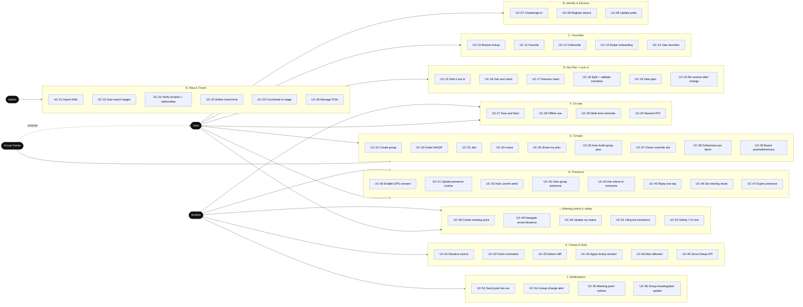
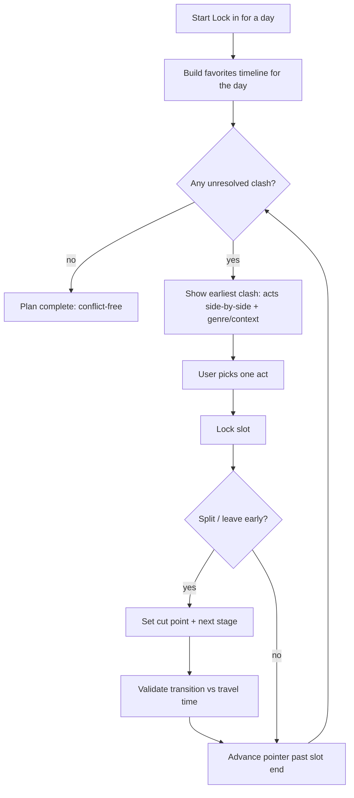

# FestPilot — V1 Use Cases

> Last updated: 2026-06-23 (from `/diagrams`). The canonical V1 use-case list, grouped by domain,
> traceable to `product-spec.md` + `decision-log.md`. Companion: `v1-data-model-d1-schema.md`.
> Scope = **all 6 phases MUST SHIP** (DEC-023). The brain overrides this doc if they disagree.

## Actors
| Actor | Definition |
|-------|-----------|
| **User** | A festival-goer with a (lightweight) account — favorites, plan, groups, presence, meeting points. |
| **Group Owner** | A User who created a group; *extends* User with owner-only actions. |
| **Admin** | Festival setup/curation: map import, stage placement, travel times, POIs. |
| **System** | Automated/scheduled processes: ingestion, reminders, lifecycle, push fan-out. |

## Use-case overview (actors ↔ domains)

---

## A. Lineup & Data (System)
| # | Use Case | Actor |
|---|----------|-------|
| UC-01 | Resolve lineup source (`event`+`uuid`) from the official `__NEXT_DATA__` page | System |
| UC-02 | Fetch + normalize lineup (config/stages/performances): timezone, +1s, midnight | System |
| UC-03 | Detect changes (ETag/Last-Modified/SHA-256) and diff against the DB | System |
| UC-04 | Apply update in a transaction, mark removed acts inactive, bump `lineup_revision` | System |
| UC-05 | Alert users whose favorited/locked acts changed | System |
| UC-06 | Serve festival/lineup/stages to the app (read API; clients never hit the festival site) | System |

**Rules:** Never hardcode `uuid` (re-resolve every run). Removed acts → `active=0`, never hard-deleted. Fallback chain: saved event/uuid → re-resolve on 404 → render page → last snapshot flagged stale. Cadence scales from daily → ~5–10 min during the festival.

## B. Identity & Devices (User)
| # | Use Case | Actor |
|---|----------|-------|
| UC-07 | Sign in — **anonymous by default**; **upgrade to Google/Apple (email-link fallback)** to create/join a group (DEC-024) | User |
| UC-08 | Register a device for push (FCM token) | User |
| UC-09 | Update notification/sharing preferences | User |

**Rules (DEC-024):** Anonymous from the first launch (no auth wall for Pillars 1–2). A **permanent account is required to create/join a group** (Pillar 3); anonymous→permanent linking preserves the `uid` so favorites/plan carry over. Workers verify the Firebase ID token behind `getUserFromRequest()`. Ship Apple + Google together (App Store).

## C. Favorites — Pillar 1 (User)
| # | Use Case | Actor |
|---|----------|-------|
| UC-10 | Browse the full lineup by artist / stage / day | User |
| UC-11 | Favorite an act ("want to see") | User |
| UC-12 | Unfavorite an act | User |
| UC-13 | Fast swipe-favoriting onboarding | User |
| UC-14 | View my favorites (overlaps included) | User |

**Rules:** Favoriting is a wish — **overlaps allowed**. Favorites are the raw material for Pillar 2 and the group fallback (Pillar 3).

## D. My Plan / "Lock in" — Pillar 2 (User)
| # | Use Case | Actor |
|---|----------|-------|
| UC-15 | Start "Lock in" for a festival day | User |
| UC-16 | Get the next clash (chronological, gated) | User |
| UC-17 | Resolve a clash — pick one act → lock a slot | User |
| UC-18 | Split a slot (partial set): set a cut point + validate the transition vs travel time | User |
| UC-19 | View my conflict-free plan per day | User |
| UC-20 | Re-resolve the plan after a lineup change created a new clash | User |

**Rules:** At most **one act per moment**. Resolution is **chronological**; the next clash unlocks only after the locked slot ends. Support cut points + `canMakeTransition()` (never raw-time-only). The locked plan must have **zero overlaps** (invariant).

## E. Map & Travel (Admin / System)
| # | Use Case | Actor |
|---|----------|-------|
| UC-21 | Import a map seed (KML/KMZ) → `imported_map_feature` | Admin |
| UC-22 | Auto-match imported features to official stages (normalized name + alias) | System |
| UC-23 | Verify/place a stage location (center + radius); edit aliases; place unmatched stages | Admin |
| UC-24 | Define stage-to-stage travel time (typical + crowded) | Admin |
| UC-25 | Resolve a coordinate → stage area (at/near/between + confidence) | System |
| UC-26 | Manage practical POIs (toilets/water/medical/exits/ATM/charging/lockers) | Admin |

**Rules:** KML coords are `lng,lat`. Seed is **unverified** until an admin confirms (DEC-021). V1 areas = **circles** (polygon V2). Travel times **manual** (learned V2).

## F. On-site essentials (User / System)
| # | Use Case | Actor |
|---|----------|-------|
| UC-27 | View "Now & Next" (on now / next pick / where / when-to-leave countdown) | User |
| UC-28 | Use the app offline (cached lineup, my plan, map/POIs, last group plan) | User |
| UC-29 | Send a walk-time-aware "leave now" reminder | System |
| UC-30 | Find the nearest POI of a type | User |

**Rules (DEC-022):** Offline-first is mandatory. Reminders account for travel time from the current/previous stage.

## G. Groups — Pillar 3a (User / Owner)
| # | Use Case | Actor |
|---|----------|-------|
| UC-31 | Create a group | User |
| UC-32 | Invite via link / QR | Owner |
| UC-33 | Join a group (via invite token) | User |
| UC-34 | Leave a group | User |
| UC-35 | Share my plan with the group | User |
| UC-36 | Auto-build the group timetable (plurality → favorites-fallback → owner) | System |
| UC-37 | Override a group slot (owner) | Owner |
| UC-38 | Per block: follow the group or do-my-own (with favorites-fallback offer) | User |
| UC-39 | Post / edit / remove a pinned group board note | User |

**Rules (DEC-013):** Plurality wins per block; tie → most-favorited → owner. A non-matching lock is offered the member's best favorite at that block. **Never silently override a locked must-see.** Splits are shown, never prevented. **Group board** is in V1; **no real-time chat**.

## H. Live Presence — Pillar 3b (User / System)
| # | Use Case | Actor |
|---|----------|-------|
| UC-40 | Enable GPS (consent at the point of use) | User |
| UC-41 | Update presence (raw fix → coarse stage + confidence) | User |
| UC-42 | Auto-detect current artist from presence + lineup | System |
| UC-43 | View group presence (grouped by stage + coarse map markers) | User |
| UC-44 | Ask "where is everyone?" | User |
| UC-45 | Reply to "where is everyone?" (one-tap, pre-filled nearest stage) | User |
| UC-46 | Set sharing mode (off / while-using / live time-boxed), per group | User |
| UC-47 | Expire stale presence | System |

**Rules (DEC-006/007/008/012/015):** Clients get **stage + confidence**, never raw coordinates. Presence expires (gps ~15m, manual/push ~45m). Push-reply + manual are first-class fallbacks. Sharing is per-group + time-boxed.

## I. Meeting Points & Safety — Pillar 3c (User / System)
| # | Use Case | Actor |
|---|----------|-------|
| UC-48 | Create a meeting point ("come to me") + photo + note + expiry + visibility | User |
| UC-49 | Navigate to a meeting point (compass arrow + distance) | User |
| UC-50 | Update my meeting-point status (going/arrived/left) | User |
| UC-51 | Advance meeting-point lifecycle (expiring_soon → expired → empty → archived) + smart prompts | System |
| UC-52 | Trigger Safety / "I'm lost" — share exact location + show nearest exit/medical | User |

**Rules (DEC-014/015/022):** Exact coordinates leave the server **only** via a meeting point or the safety share. The pin fades as it ages; the record (who went) stays. Photos in R2 archive/purge with the point.

## J. Notifications (System)
| # | Use Case | Actor |
|---|----------|-------|
| UC-53 | Send a push (fan-out via FCM) | System |
| UC-54 | Lineup-change alert to affected users | System |
| UC-55 | Meeting-point notifications ("created", "still there?") | System |
| UC-56 | Group-heading / plan-update notification | System |

**Rules:** Interactive actions (Yes / Change stage / I'm coming) require native notification actions → delivered via the Capacitor shell (DEC-003).

---

## Coverage check (spec → UC)
| Spec feature | UC(s) |
|--------------|-------|
| Lineup ingestion + auto-updater (§7, DEC-009) | UC-01…06 |
| Favorites, 3 browse modes, swipe (§6 P1) | UC-10…14 |
| Lock-in, gated clashes, partial sets + travel validation (§6 P2) | UC-15…20 |
| Map seed import + admin verify, travel matrix, coord→stage (§8, DEC-021/010/011) | UC-21…25 |
| Practical POI layer (§8.1, DEC-022) | UC-26, UC-30 |
| Now&Next, offline, walk-time reminders (§14, DEC-022) | UC-27…29 |
| Groups, group timetable, override, follow/split, invites, board (§6 P3, DEC-013) | UC-31…39 |
| Coarse presence, current artist, group view, where-is-everyone, sharing (§9, DEC-006/007/008/012) | UC-40…47 |
| Meeting points + lifecycle + nav + safety (§10/§11, DEC-014/022) | UC-48…52 |
| Notifications (§11) | UC-53…56 |

**Out of scope (no UC, correctly):** polygon areas, learned travel times, multi-festival, per-block voting, recap/ratings, real-time chat, monetization (all V2 / V1.x).

## Assumptions & gaps (surface before the relevant phase)
- ✅ **Auth mechanism — RESOLVED (DEC-024):** Firebase Auth, anonymous-first; upgrade to Google/Apple (email-link fallback) required to use groups. Workers verify the Firebase ID token behind `getUserFromRequest()`.
- **Offline sync contract (Phase 3):** what's cached, conflict handling on reconnect, and how the client learns of a new `lineup_revision`. Define explicitly.
- **POI completeness:** the KML seeds areas/entrances; toilets/water/medical density will need admin additions (UC-26) — acceptable for V1.
- **"Time block" granularity** for the group plan (UC-36): align with how performances slice the day (per-set vs fixed blocks). Decide in Phase 4.
